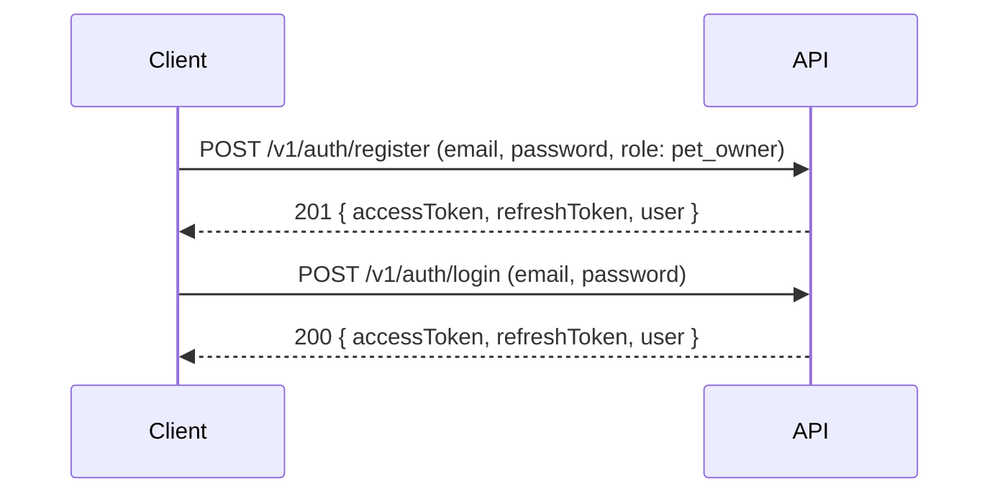
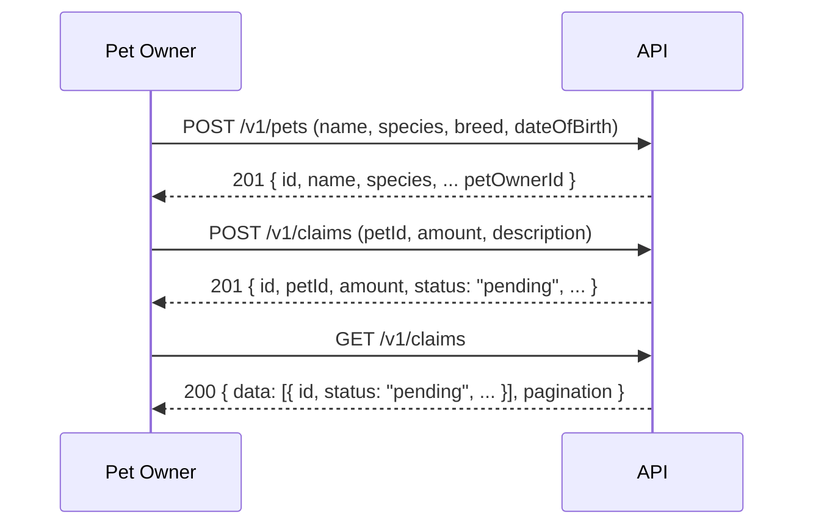
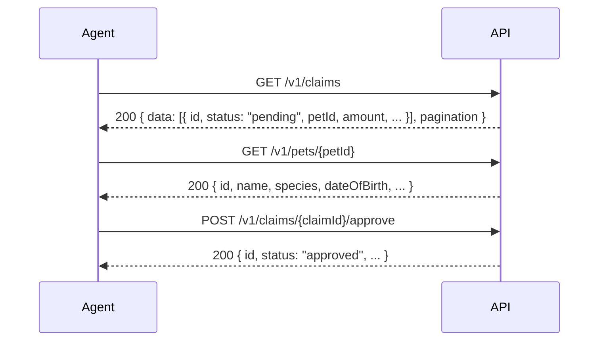
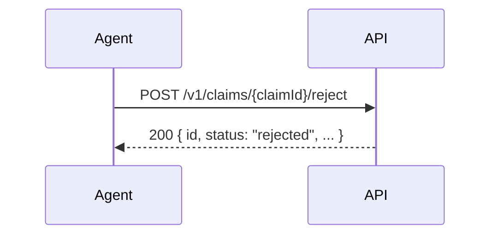
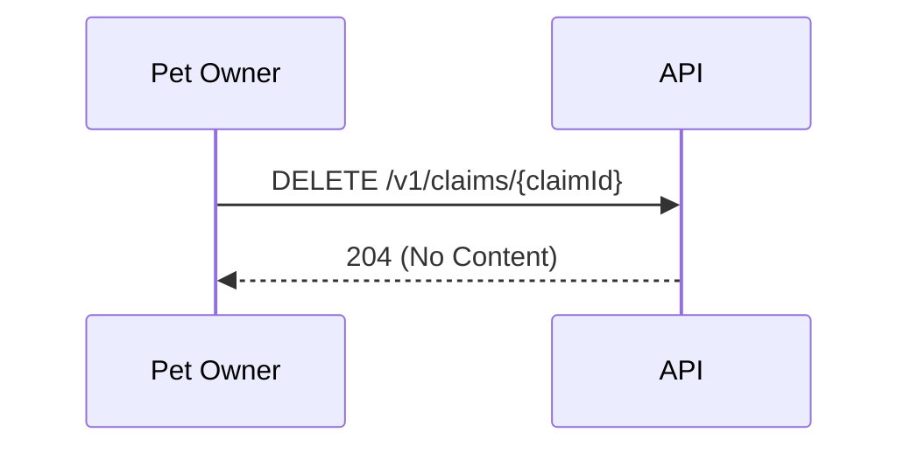
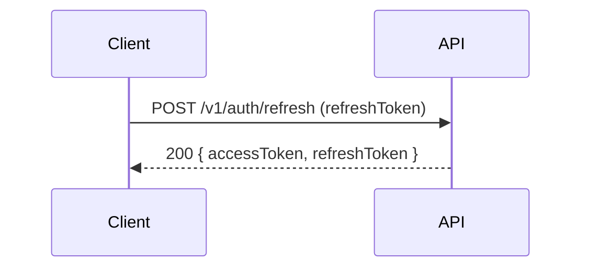

# Sequence Diagrams — Pet Insurance

---

## Overview

Key interaction flows for the Pet Insurance domain.

All authenticated requests include `Authorization: Bearer <token>` header (omitted from diagrams for brevity). `4xx` error paths are omitted; see `auth-matrix.md` for access control rules.

---

## Flow 1: Registration and Login

---

## Flow 2: Pet Owner Registers a Pet and Submits a Claim

---

## Flow 3: Agent Reviews and Approves a Claim

---

## Flow 4: Agent Rejects a Claim

---

## Flow 5: Pet Owner Cancels a Pending Claim

---

## Flow 6: Token Refresh

